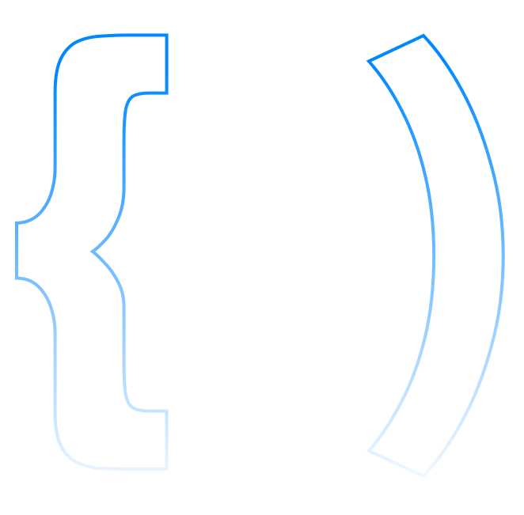

  

<!--  -->

#  Olá! Sou João Marcos!    

## 💻 Qa Tech Lead | Chapter Lead | Sênior

Sou um cara hands-on com muita
facilidade em absorver novos conhecimentos,
atualmente estou atuando como Tech Lead & Chapter Lead, definindo todo o processo de Qa dentro da organização, responsável por todo o time de qualidade e processos relacionados a qualidade de software.

<h4 align="center">

  
</h4>

<!-- ## 🏆 Certificações:

 -->

## Experiência em Automação de Testes:

  
  
  
  
  
  
  
  
  
  
  
  
  
  
  
  
  
  
  
  
  
 

 
 ## Sistemas Operacionais:
 

  
  
  

## GitHub Stats
|  |  |  |
| :-: | :-: | :-: |

|  |  |
| :-: | :-: |
  
## 💻 Experiência de Trabalho
Tech Lead | Chapter Lead | Sênior
Quality Corp | Jan. de 2022 - presente
Reestruturação de toda area de qualidade da empresa, treinamento de equipe relacionado a regra de negócio, linguagens, boas práticas, hard e softskills do time de Qa. Construção dos scripts de testes usando BDD, Abertura e acompanhamento de bugs , Envio de status report, com andamento das atividades de testes, Participação em todas as cerimonias do Scrum, Automação de testes com Robot Framework e Python, execução de testes Web, Mobile e API.

Engenheiro de Qualidade
Quality Corp | Jun. de 2021 - Jan de 2022
Construção dos scripts de testes usando BDD, Abertura e acompanhamento de bugs , Envio de status report, com andamento das atividades de testes, Participação em todos eventos Scrum, Automação de testes com Robot Framework e Python, execução de testes Web, Mobile e API.

Engenheiro de Qualidade
Cyber Solutions | Jan. de 2017 até Mai. de 2021
Abertura e acompanhamento de bugs , Envio de status report, com andamento das atividades de testes, Participação em todos eventos Scrum, Automação de testes com Java e Cypress, execução de testes Web, Mobile e API.

## 📝 Histórico Acadêmico
- [Fiap]Engenharia de Software | Jun. 2021 até Jun. 2026
- [Unifaccamp]Administração de empresas | Jan de 2015 - Dez de 2019

## 💻 Hard Skills
Planejamento dos casos de testes.
Construção dos scripts de testes usando BDD.
Execução dos testes funcionais.
Abertura e acompanhamento de bugs.
Elaboração da massa de teste.
Manutenção de scripts de testes.
Automação de testes com Java, Playright, Robot Framework e Cypress.
Teste de carga/stress com Jmeter, Locust e Gatling.
Conhecimento em Jira, Microsoft Azure e TFS.
Criação de documentações.
Estruturar Chapter de Qa dentro de uma organização.

## 💻Automação Web, Mobile e API:
Robot Framework,
Cypress,
Playright,
Java.

## 💻Testes de Carga:
Gatling,
K6,
Locust,
Jmeter.

## 💻CI/CD:
Jenkins,
Azure Devops,
Gitlab CI,
Circle Ci,
Drone.io.

## 💻Testes Unitários:
Pytest,
Jasmine.

## 💻Git:
Github,
Gitlab,
BitBucket.
